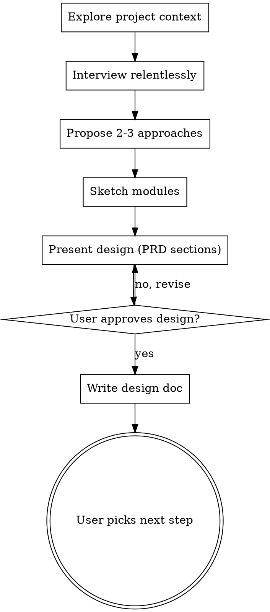

# Brainstorming Ideas Into Designs

## Overview

Turn ideas into fully formed PRD-style design docs through natural collaborative dialogue.

Start by understanding the current project context (use subagents), then interview the user relentlessly — one question at a time via `ask_user_question` (interactive dropdowns). Walk down each branch of the design tree, resolving dependencies between decisions one by one. Once you understand what you're building, present the design and get user approval.

**CRITICAL: Use `ask_user_question` for ALL questions to the user.** This gives them interactive dropdowns instead of walls of text. Only fall back to plain text for truly open-ended questions that cannot be structured into 2-4 options.

<HARD-GATE>
Do NOT invoke any implementation skill, write any code, scaffold any project, or take any implementation action until you have presented a design and the user has approved it. This applies to EVERY project regardless of perceived simplicity.
</HARD-GATE>

## Anti-Pattern: "This Is Too Simple To Need A Design"

Every project goes through this process. A todo list, a single-function utility, a config change — all of them. "Simple" projects are where unexamined assumptions cause the most wasted work. The design can be short (a few sentences for truly simple projects), but you MUST present it and get approval.

## Checklist

You MUST create a task for each of these items and complete them in order:

1. **Explore project context** — check files, docs, recent commits
2. **Interview relentlessly** — one question at a time via ask_user_question, walk every branch of the decision tree, resolve dependencies between decisions
3. **Propose 2-3 approaches** — with trade-offs and your recommendation
4. **Sketch modules** — identify major modules to build/modify, look for deep modules (small interface, large implementation), confirm with user
5. **Present design** — in sections using the PRD template below, get user approval after each section
6. **Write design doc** — save to `.agents/plans/YYYY-MM-DD-<topic>-design.md`
7. **Transition** — ask user to pick next step: grill-me / prd-to-issues / done for now

## Process Flow



**The terminal state is the user choosing the next step.** Present an ask_user_question with three options: grill-me (stress-test the design), prd-to-issues (decompose into slices), or implement (start building directly).

## The Process

**Understanding the idea:**
- Check out the current project state first (files, docs, recent commits)
- Interview the user relentlessly about every aspect of the idea
- Walk down each branch of the design tree, resolving dependencies between decisions one by one
- Don't accept vague answers — push for specifics
- **ALWAYS use the `ask_user_question` tool** for questions — interactive dropdowns, not plain text
- Only one question per message (the tool supports 1-4 questions, but keep it focused)
- Focus on understanding: purpose, constraints, success criteria
- Use `multiSelect: true` when choices aren't mutually exclusive (e.g. "Which concerns should we address?")
- Add your recommended option first with "(Recommended)" in the label
- Use the `description` field on each option to explain trade-offs or implications
- Use the `preview` field when comparing concrete artifacts (code snippets, ASCII layouts, config examples)
- Fall back to plain text only when the question is truly open-ended and can't be structured into 2-4 options

**Exploring approaches:**
- Use `ask_user_question` with `preview` fields to present approaches side-by-side
- Each option = one approach, with trade-offs in the `description` field
- Put your recommended approach first with "(Recommended)" in the label
- Use previews to show concrete differences (e.g. code structure, directory layout, API shape)
- The user can always pick "Other" to suggest something different

**Sketching modules:**
- Sketch out the major modules you will need to build or modify
- Look for opportunities to extract deep modules — a deep module (Ousterhout, "A Philosophy of Software Design") encapsulates a lot of functionality behind a simple, testable interface that rarely changes
- Confirm with the user that these modules match their expectations
- Ask which modules they want tests written for

**Presenting the design:**
- Present the design using the PRD template sections below
- Scale each section to its complexity: a few sentences if straightforward, up to 200-300 words if nuanced
- Use `ask_user_question` after each section to confirm approval before moving on (e.g. options: "Looks good", "Needs changes", "Let's rethink this")
- Be ready to go back and clarify if something doesn't make sense
- When it is a complicated design, use the excalidraw skill to create a diagram illustrating the design and get approval on that as well, make sure to open the diagram in the browser so the user can see it and approve it

## PRD Template

The design doc MUST use this structure:

### Problem Statement
The problem from the user's perspective.

### Solution
The solution from the user's perspective.

### User Stories
A LONG, numbered list of user stories in the format:
1. As an <actor>, I want a <feature>, so that <benefit>

This list should be extensive and cover all aspects of the feature.

### Implementation Decisions
Decisions made during the interview:
- Modules to build/modify and their interfaces
- Architectural decisions
- Schema changes
- API contracts
- Specific interactions

Do NOT include specific file paths or code snippets — they may become outdated quickly.

### Testing Decisions
- What makes a good test (test external behavior, not implementation details)
- Which modules will be tested
- Prior art for the tests (similar tests in the codebase)

### Out of Scope
Things explicitly excluded from this design.

### Further Notes
Any additional context.

## After the Design

**Documentation:**
- Write the validated design to `.agents/plans/YYYY-MM-DD-<topic>-design.md`
- Use writing-clearly-and-concisely skill

**Next step:**
- Ask the user which step they want next via `ask_user_question`:
  - **grill-me** — stress-test the design, find holes and contradictions
  - **prd-to-issues** — decompose into vertical slices (local issue files)
  - **Done for now** — design doc is saved, user will start /autopilot later (e.g. overnight)

## Key Principles

- **ask_user_question is the default** — every question, approach selection, and section approval MUST use ask_user_question. Plain text questions are a last resort.
- **Interview relentlessly** — walk every branch of the decision tree, don't accept vague answers, push for specifics
- **One question at a time** — don't overwhelm with multiple questions
- **YAGNI ruthlessly** — remove unnecessary features from all designs
- **Explore alternatives** — always propose multiple approaches before settling
- **Incremental validation** — present design, get approval before moving on
- **Deep modules** — look for opportunities to hide complexity behind simple interfaces
- **Be flexible** — go back and clarify when something doesn't make sense

## ask_user_question Patterns

Use these patterns throughout the brainstorming process:

**Clarifying question (single-select):**
```
question: "How should we handle authentication?"
header: "Auth"
multiSelect: false
options:
  - label: "JWT tokens (Recommended)"
    description: "Stateless, scales horizontally, standard for APIs"
  - label: "Session-based"
    description: "Server-side state, simpler but requires sticky sessions"
  - label: "OAuth2 delegation"
    description: "Delegate to identity provider, more setup but enterprise-ready"
```

**Scope question (multi-select):**
```
question: "Which areas should we include in this refactor?"
header: "Scope"
multiSelect: true
options:
  - label: "Architecture"
    description: "Layer violations, dependency direction, port placement"
  - label: "Type safety"
    description: "Remove type: ignore, add proper generics, typed dicts"
  - label: "Code quality"
    description: "DRY violations, complexity, dead code"
  - label: "Test coverage"
    description: "Missing tests, fixture deduplication, parametrize"
```

**Approach comparison (with previews):**
```
question: "Which directory structure for the new module?"
header: "Structure"
multiSelect: false
options:
  - label: "Flat (Recommended)"
    description: "All files in one directory, simple for small modules"
    preview: "adapters/checks/\n├── executor.py\n├── registry.py\n└── types.py"
  - label: "Nested by concern"
    description: "Subdirectories per responsibility, scales better"
    preview: "adapters/checks/\n├── execution/\n│   ├── python.py\n│   └── sql.py\n├── registry.py\n└── types.py"
```

**Section approval:**
```
question: "Does the core layer design look right?"
header: "Approve"
multiSelect: false
options:
  - label: "Looks good"
    description: "Move on to the next section"
  - label: "Needs changes"
    description: "I'll explain what to adjust"
  - label: "Rethink this"
    description: "The approach isn't right, let's go back"
```

